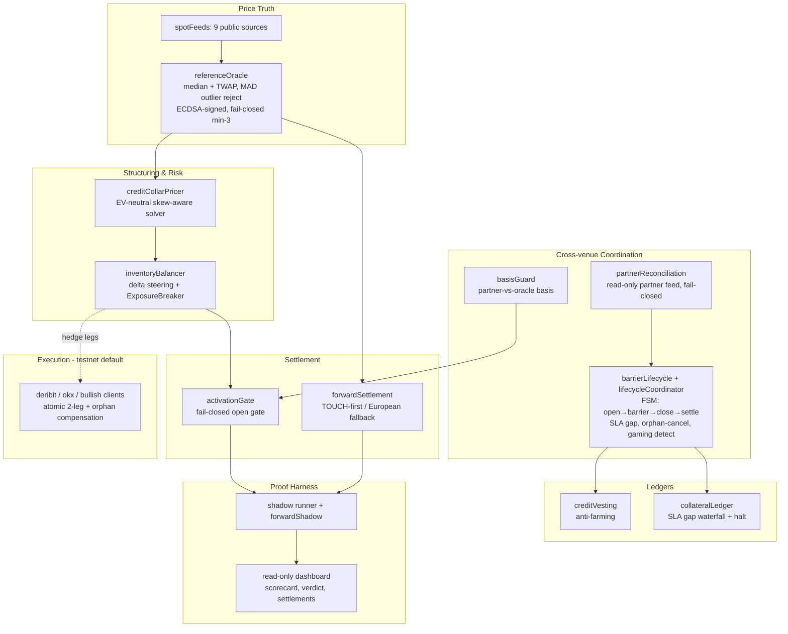

# Atticus Platform — Architecture, Flow & Use-Case Brief

> **Purpose of this document.** This is a high-level, self-contained brief for an agent evaluating the
> **best use case(s)** for the platform. The first product built on it is a **credit collar** (downside
> protection) for Foxify's perp traders — but the underlying system is a set of **reusable primitives**
> (a signed price/settlement oracle, an EV-neutral options-structuring engine, a market-neutral
> hedging/inventory engine, a cross-venue lifecycle coordinator, and a zero-capital proof harness).
> The hypothesis worth testing: **offering these primitives to other exchanges may create more immediate
> value than the protection product alone.** This doc describes the capabilities so that question can be
> answered. It is deliberately product-agnostic where possible.

---

## 1. One-paragraph summary

Atticus runs a **market-neutral matched book**: it sells an exchange (today, Foxify) a short-dated
**net-credit collar** that protects a trader's perp position (a price **floor** + a **capped upside**),
and immediately **hedges every leg on an options venue** (Deribit/Bullish) so it carries no directional
risk. The collar is structured to throw off a small **net credit** (~the exchange's per-position fee),
financed by the surrendered upside tail; Atticus keeps a thin **~2 bps service fee**. Everything is
**oracle-settled** (a multi-source, ECDSA-signed price), coordinated cross-venue (perp on the partner
exchange, hedge on the options venue), and proven on **live data with zero capital** via a shadow
harness before any real money moves.

---

## 2. How the current product works (plain English)

Think of it as **insurance that pays for itself by selling off lottery tickets.**

- A trader is long a BTC perp. Atticus wraps it in a **collar**: a bought **put** (floor, e.g. −4%) +
  a sold **call** (cap, e.g. +2%).
- BTC puts cost more than calls (downside skew), so to make the structure a **net credit** the cap is
  set tighter than the floor. The trader gives up more upside; in return the structure pays a small
  **credit ≈ the exchange's per-position fee**.
- **How the exchange gets paid:** the credit is **not** upfront cash. It is **accrued** to a balance,
  **vests** over the position's life (anti-farming), and is **netted at settlement**. If price stays
  central, they keep the full credit (fee covered). If price blows past the cap, the credit offsets
  what's owed on the short call.
- **How Atticus stays flat:** it **back-to-backs every collar** on Deribit/Bullish (buys the put it's
  short, sells the call it's long) → net options exposure ≈ 0. Across all positions it **steers the
  book's net delta toward flat** (like a market-maker managing inventory) and **halts new opens** if it
  can't stay flat (never warehouses direction).
- **Atticus's only real risk** is small **gap risk**: slippage when price slices through a strike and
  the perp closes late. That's covered by exchange-posted **collateral** via an SLA waterfall + a
  small reserve.

> **Honest framing (important for any pitch):** the collar is **EV-neutral** — the trader/exchange's
> expected value *from the option itself* is slightly negative (= −Atticus's margin). The value is
> **fee coverage on the typical trade + a hard floor + zero market risk**, paid for by the rare
> upside tail. It is not "free money." Any use case must respect this.

---

## 3. Architecture (high level)



**Cross-venue model (3 price references):** the trader's **perp** lives on the **partner exchange**
(where their P&L is real); Atticus's **hedge** lives on **Deribit/Bullish**; the collar **settles** on
the **oracle** (median/TWAP of 9 sources). The gap between these is **basis risk**, measured and gated.

---

## 4. The reusable primitives (the key section for use-case discovery)

Each of these is a **standalone, tested capability** that could anchor a different product or be sold
to a different customer. Maturity: **Tested** = pure logic + unit tests; **Shadow** = runs on live
data, zero capital; **Testnet** = real venue calls on test/demo; **Live** = real money (none yet).

| # | Primitive | What it does | Maturity | Sellable as… |
|---|-----------|--------------|----------|--------------|
| P1 | **Signed multi-source oracle** (`referenceOracle`, `spotFeeds`) | 9-source median + TWAP, MAD outlier rejection, **ECDSA-signed**, **fail-closed** (min-3 quorum), independently recomputable | Shadow | A **settlement / price-truth oracle** for any venue: liquidation reference, dispute resolution, index, proof-of-fair-settlement |
| P2 | **EV-neutral options structuring engine** (`creditCollarPricer`) | Skew-aware solver that builds a structure to a **target net credit/debit** subject to a max floor; rejects mispriced (positive-EV) quotes | Tested | A **structured-product factory**: collars, covered calls, principal-protected notes, fee-financed protection |
| P3 | **Market-neutral hedging + inventory engine** (`inventoryBalancer`, execution clients) | Back-to-back leg hedging, **net-delta steering toward flat**, latching **ExposureBreaker**, atomic 2-leg execution + orphan compensation | Tested + Testnet | **Auto-hedging / risk-warehousing-as-a-service** for an exchange's options/structured book |
| P4 | **Cross-venue lifecycle coordinator** (`barrierLifecycle`, `lifecycleCoordinator`, `partnerReconciliation`) | FSM that reconciles a position across two venues from a **read-only feed**: open-confirm, **orphan-cancel**, **close-SLA + gap accountability**, breach/forfeit, **gaming detectors** (phantom/size/churn/cherry-pick); fail-closed on bad data | Tested (live feed = config) | **Settlement/clearing coordination + abuse detection** between an exchange and a hedger/clearer |
| P5 | **Collateral + credit ledgers** (`collateralLedger`, `creditVesting`) | Segregated collateral with an **SLA gap-debit waterfall + halt**, and **time-vesting credit** with clawback/forfeit (anti-farming) | Tested | A **fee-coverage / rebate-financing engine**; collateral management for a protection program |
| P6 | **Touch-first settlement** (`forwardSettlement`, `tickHistoryStore`) | Settles **at a barrier touch** (early margin release) with **European fallback** at expiry; vesting netted in; fail-closed on unverified oracle/basis | Tested + Shadow | A **settlement engine** for barrier/American-style payoffs |
| P7 | **Fail-closed activation gate** (`activationGate`) | Hard gate on opening: oracle-safe + collateral-ok + feed-healthy + basis-safe, all required | Tested | A **risk kill-switch / circuit-breaker** layer for any automated program |
| P8 | **Zero-capital proof harness** (`shadowRunner`, `forwardShadow`, `shadowDashboard`) | Runs the whole system on live prices with **no capital**, builds a **track record + verdict** (CLEAN/WATCH/DEGRADED), serves a **read-only signed dashboard** | Shadow (live, deployed) | A **proof-of-strategy / due-diligence artifact** for counterparties and venues |
| P9 | **Venue capital model** (`modelBVolumeSim`, calibrated economics) | Measured short-leg **initial margin** + **portfolio-margin netting**, capital-aware net bps | Measured (Deribit testnet) | A **venue/capital economics calculator** for sizing any matched-book program |

---

## 5. End-to-end flow (current product)

```mermaid
sequenceDiagram
  participant T as Trader (partner exchange)
  participant FX as Exchange (Foxify)
  participant AT as Atticus (bot, trade-only keys)
  participant OV as Options venue (Deribit/Bullish)
  participant OR as Oracle (signed)

  AT->>FX: signal side (steer book net-flat)
  T->>FX: open perp
  AT->>OV: buy put + sell call (hedge the collar, atomic)
  Note over AT,OR: credit accrues to a held balance, vests over time
  loop each cycle
    OR-->>AT: signed median/TWAP price
    AT->>FX: reconcile perp via read-only feed (fail-closed)
  end
  alt barrier touched (floor/ceiling)
    AT->>OV: unwind hedge (lock P&L, release margin)
    AT->>FX: emit close signal (SLA clock starts)
    T->>FX: close perp
    Note over AT: on-time → gap to reserve · late → gap debits collateral + credit forfeit
  else no touch by expiry
    OR-->>AT: settlement TWAP (European)
  end
  Note over AT,FX: net credit (vested) ± option payout settled; Atticus keeps ~2 bps
```

Key property: **Atticus cannot close the trader's perp** (it holds trade-only keys on its *own* hedge
venue). Coordination is therefore **signal + economic enforcement** — not closing on the signal *costs*
the exchange (gap + forfeited credit). That's what keeps the structure EV-neutral and un-gameable.

---

## 6. Economics & capital

- **Revenue:** ~**2 bps** service fee on notional. Capital-aware net **~1.5–2 bps** after measured
  short-leg margin cost. It is a **scale business**: needs volume + balanced two-sided flow.
- **The binding constraint is capital, not premium:** a delta-flat *options* book still posts initial
  margin on both short wings (~**13.9%** of notional measured on Deribit) **unless Portfolio Margin
  nets them** (~0.2–0.45 measured → ~55–78% capital cut). **Securing PM on one venue is the single
  biggest external dependency** and is a commercial ask, not an engineering task.
- **Capital math:** collateral ≈ concurrent positions × size × margin% × buffer(1.5–2×). $25k runs
  ~10–25 small positions isolated; $100k + PM ≈ $2–4M open.

---

## 7. Honest constraints & dependencies

| Constraint | Implication for use-case selection |
|---|---|
| **EV-neutral** | The protection product is *fee coverage + variance reduction*, not alpha. Pitches that imply "free profit" will fail the math. |
| **Portfolio Margin dependency** | Thin margin only clears with PM on one venue. Any matched-book use case inherits this. |
| **Needs balanced flow** | Inventory steering only stays flat if flow is two-sided (or steerable). One-sided flow → breaker halts. |
| **Live partner feed not yet connected** | Cross-venue coordination is built + tested; activating it on live data needs the partner exchange's read-only position endpoint (canonical contract defined; it's config, not code). |
| **Basis risk** | Settling on an oracle ≠ the trader's venue creates basis; measured + gated, best collapsed by folding partner marks into the oracle. |
| **No live trading yet** | Execution is testnet/demo-gated; everything is proven in shadow. |

---

## 8. Adjacent use cases to evaluate (seed hypotheses for the agent)

Ordered roughly by **immediacy of value / lowest lift**. Each notes the **problem it solves for the
buyer** and **which primitives it reuses**.

1. **White-label the collar to OTHER perp venues (same product, new clients).**
   *Problem solved:* a perp DEX/CEX wants to offer "fee-covered downside protection" as a retention/UX
   feature without building options infra. *Reuses:* P2–P8 essentially as-is. *Why it may be more
   valuable than Foxify alone:* it's a repeatable B2B motion; more venues = more two-sided flow = the
   balanced book the economics need. **Highest synergy with what's already built.**

2. **Sell the signed oracle as a settlement/price-truth service (P1).**
   *Problem solved:* exchanges need a **manipulation-resistant, signed, fail-closed reference price**
   for liquidations, index marks, dispute resolution, or "provably fair settlement." *Reuses:* P1
   standalone (+P8 for the verifiable dashboard). *Why immediate:* it's a discrete, low-trust-required
   product an exchange can adopt without changing its core; no PM dependency.

3. **Structured-product backend / "options-as-a-service" (B2B2C).**
   *Problem solved:* an exchange wants to offer covered calls, principal-protected products, or
   yield-on-holdings to retail but can't run an options desk. *Reuses:* P2 (structuring) + P3 (hedging)
   + P4/P6 (lifecycle/settlement). *Note:* inherits the PM dependency.

4. **Liquidation protection / margin-call cushioning.**
   *Problem solved:* exchanges lose users and take bad debt from liquidations; a cheap **floor** reduces
   both. *Reuses:* P2 (floor leg only) + P3 + P5. *Angle:* sell the *floor* as "liquidation insurance,"
   priced like the collar but framed around reducing forced closes / bad debt.

5. **Auto-hedging / inventory-risk-as-a-service (P3).**
   *Problem solved:* a venue or market-maker holding a one-sided book wants it flattened automatically
   with a hard kill-switch. *Reuses:* P3 + P7. *Discrete and capital-light to pilot.*

6. **Fee-rebate / retention financing engine (P5 + P2).**
   *Problem solved:* exchanges spend heavily on fee rebates/retention; the credit-vesting mechanism is a
   structured way to **finance fee coverage from surrendered tail value** with anti-farming built in.

7. **Reconciliation + anti-gaming/abuse detection (P4).**
   *Problem solved:* any two-party clearing/protection arrangement needs to detect phantom positions,
   size mismatches, churn, and cherry-picking. *Reuses:* P4 as a compliance/ops tool.

> **Selection lens for the agent:** weigh each on (a) **immediacy** (does it solve a problem the buyer
> has *today*?), (b) **lift** (how much of P1–P9 is reused vs. new build?), (c) **capital dependency**
> (does it need PM/collateral, or is it capital-light like the oracle?), and (d) **flow synergy** (does
> it help build the balanced, high-volume book the matched-book economics ultimately need?). The two
> standouts on immediacy + low lift are **#1 (white-label collar to more venues)** and **#2 (oracle as a
> service)** — the latter notably has **no PM dependency**.

---

## 9. Maturity snapshot (what's real today)

- **Built, tested, running in shadow on live data (zero capital):** oracle, pricer, balancer,
  touch-first + European settlement, lifecycle coordinator, fail-closed gates, collateral/vesting,
  reconciliation, dashboard. **208 unit tests passing.**
- **Measured on Deribit testnet:** real fills, atomic unwind, short-leg IM (~13.9%), PM netting.
- **Not yet live:** real-money execution (testnet/demo-gated), connected partner feed (config-ready),
  funded PM hedge account (commercial).
- **Deployed:** read-only shadow dashboard (scorecard, verdict, settlements) in Singapore.

---

## 10. Where the code lives (pointers)

All under `services/api/src/singleSide/twoSided/creditCollar/`:

| Area | Files |
|---|---|
| Oracle / price truth | `referenceOracle.ts`, `pricingHarness/spotFeeds.ts` |
| Structuring / pricing | `creditCollarPricer.ts`, `skew.ts` |
| Hedging / inventory | `inventoryBalancer.ts`, `selfCancellation.ts`, `execution/*` |
| Cross-venue lifecycle | `barrierLifecycle.ts`, `lifecycleCoordinator.ts`, `partnerReconciliation.ts`, `partnerFeedFactory.ts`, `basisGuard.ts` |
| Ledgers | `collateralLedger.ts`, `collateralStore.ts`, `creditVesting.ts` |
| Settlement / gates | `forwardSettlement.ts`, `tickHistoryStore.ts`, `activationGate.ts`, `lifecycleStateStore.ts` |
| Proof harness | `shadowRunner.ts`, `forwardShadow.ts`, `shadowAggregate.ts`, `shadowDashboard.ts`, `*Store.ts` |
| Capital economics | `modelBVolumeSim.ts`, `scripts/creditCollarCalibratedEconomics.ts` |
| Tests | `services/api/tests/creditCollar*.test.ts` |

Run: `npm --workspace services/api test` (filter `TEST_FILTER=creditCollar`) · shadow service:
`npm --workspace services/api run shadow:service` · economics: `npm --workspace services/api run modelb:calibrated`.

---

## 11. Open questions for the use-case agent

1. Which buyers feel a problem **today** that primitives P1/P2/P4 solve without a capital commitment?
2. Is the **oracle (P1)** a faster wedge than the collar (no PM dependency, discrete adoption)?
3. Does **white-labeling to more venues (#1)** accelerate the balanced-flow flywheel the economics need?
4. For each candidate, what's the **smallest pilot** that proves value (mirroring the zero-capital shadow approach)?
5. Which use cases let Atticus **earn before** securing Portfolio Margin (de-risking the main dependency)?
