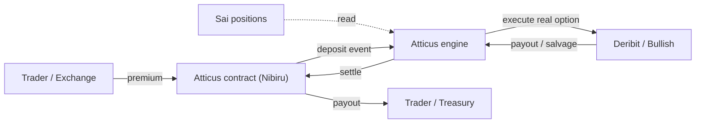
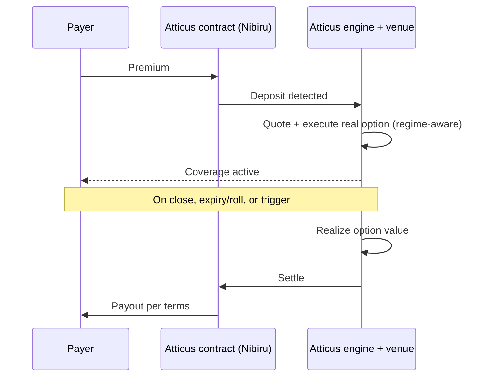

# Atticus × Sai (Nibiru) — Options-Based Protection Integration

Technical integration documentation for the Sai perp exchange on Nibiru. Covers the
protection features Atticus can provide, the integration surface, the settlement model,
and the data Atticus requires. Primary supported markets are **BTC and ETH**; other
markets are supported as venue liquidity allows and are noted as configurable.

---

## 1. Executive Summary

Atticus is a non-custodial, options-based protection layer for perpetual exchanges. It
prices and executes real listed options on major venues and settles outcomes to
smart contracts on the partner chain — for Sai, contracts on Nibiru. Three integration
features are described here: a paid **collateral-floor upgrade** for leveraged traders,
**bad-debt / tail protection** for the exchange, and a set of **configurable** trader,
treasury, and market-maker protections. Because Atticus routes real option liquidity and
settles on-chain without holding user funds, Sai gains a capital-efficient risk-transfer
mechanism and a differentiated trader product with no custody exposure.

---

## 2. Terminology

| Term | Meaning in this document |
|---|---|
| Premium | Up-front amount paid to obtain protection for a defined tenor |
| Tenor | The time window a protection covers (options are dated; coverage is rolled) |
| Strike | The price level at which an option's protection engages |
| Floor | The bounded worst-case loss a covered position can incur |
| Trigger | The condition (price level and/or attested event) that fires a payout |
| Coverage | An active protection instance attached to a position, account, or treasury |
| Settlement | On-chain delivery of a protection's net result to the designated contract |

---

## 3. How Atticus Works

A payer (a trader or the exchange) submits a premium, which is received by an Atticus
settlement contract on Nibiru. Atticus executes a corresponding real option at a venue —
a put to protect a long, a call to protect a short — sized and struck to the exposure
being protected. When the protected position closes, the option reaches expiry, or a
trigger condition is met, the option's realized value is settled back through the contract
to the trader or exchange treasury under the agreed terms. Atticus operates as a
pass-through intermediary of real options and earns a transparent spread or fee; it does
not pool user funds or act as a synthetic underwriter.

Premiums and structures are quoted in real time from live venue markets and prevailing
volatility, and the protective structure is selected in a volatility-regime-aware manner so
that coverage is cost-efficient in calm conditions and robust in stressed conditions. The
internal pricing and structure-selection logic is proprietary; integration consumers
interact only with quoted terms and outcomes (Section 8). Settlement is non-custodial at
the trader and exchange layer; the venue-execution model is described precisely in
Section 10.

---

## 4. Feature 1 — Leveraged Floor

A trader pays a premium and receives an expanded effective collateral floor. Because the
position's maximum loss is bounded by an option for the coverage tenor, the exchange's
margin engine can recognize additional headroom and permit larger size (or reduced
liquidation risk at equal size).

**Mechanics.** The trader elects coverage and pays a premium; Atticus executes a protective
option struck at or near the position's liquidation price for a chosen tenor and sized to
the exposure; the option is referenced as collateral by the margin engine, which applies
the floor uplift; the trader trades the perp under the expanded floor for the tenor.

**Who pays / benefits.** The trader pays the premium. The trader gains size and reduced
liquidation risk; the exchange benefits from healthier positions, lower liquidation and
bad-debt incidence, and a premium product offering.

**Risk profile.** Downside is bounded for the covered tenor at the option strike; upside is
unaffected. The premium is the trader's defined cost for the protection.

**Sizing.** Premium scales with notional, tenor, and the prevailing volatility regime;
option notional matches the protected exposure. Strike placement is at the liquidation
price (full floor) or buffered (lower premium, partial floor).

**Settlement.** On perp close or option expiry, the option's value is realized and the net
delivered to the designated contract. If the adverse move occurred, the payout offsets the
loss up to the floor; otherwise the net cost is the premium less any residual option value.

**Tenor and rollover.** A perpetual position is covered in dated tenor windows that are
rolled at expiry under a configurable policy; each roll carries a cost and a brief coverage
seam.

**Customization.** Maximum leverage uplift, eligible markets, strike placement, tenor and
roll policy, premium model, and protective structure are all tunable (Section 14).

**Exchange-side requirement.** The margin/liquidation engine must recognize the referenced
option as collateral for the floor uplift to take effect. Atticus supplies the option and
an attestable coverage reference; the exchange's risk engine consumes it.

---

## 5. Feature 2 — Bad Debt Protection

When a position moves through its margin faster than liquidation can complete — a price
gap, a liquidation cascade, or oracle lag — the exchange absorbs the deficit. Atticus
transfers that exposure to real options that settle to the exchange treasury.

**Illustrative scenario.**

| Item | Value |
|---|---|
| Position | Long BTC, $100,000 notional at 10x |
| Posted margin | $10,000 |
| Gap move | BTC declines ~12% before liquidation completes |
| Loss on position | ~$12,000 |
| Margin available | $10,000 |
| Deficit absorbed by exchange | ~$2,000 (bad debt) |

**Mechanics.** The exchange holds out-of-the-money protective options (puts against
net-long exposure, calls against net-short) struck where deficits begin. On a qualifying
move, the option is in-the-money and its payout settles automatically to the treasury
contract; the insurance-fund draw is replaced by an option payout.

**Who pays.** Typically the exchange, as a cost of insurance. Configurable alternatives
include a per-trade fee shared with traders or a leverage-tiered premium.

**Coverage scope (configurable).**

| Scope | Covers | Sizing |
|---|---|---|
| Single-trade | One flagged position | Static, matched to the position |
| Position-level | A specific account/market | Matched per position |
| Portfolio-level | The exchange's net book | Dynamic, sized to net exposure and rebalanced |

**Claim mechanics.** No manual claims. A trigger — price through the coverage strike with a
confirmed deficit — is established via the attestation mechanism (Section 12) and
authorizes automatic settlement to the exchange contract.

**Capital efficiency.**

| Model | Capital posture | Tail behavior |
|---|---|---|
| Self-insured fund | Large idle reserve held against worst case | Reserve can be exhausted by a sufficiently large gap |
| Atticus protection | Premium per tenor; minimal idle capital | Tail transferred to a real option payout, bounded by coverage |

The exchange can operate a smaller insurance fund and pay a known premium stream rather
than reserving against the worst case.

**Behavioral notes.** Coverage uses the same dated-tenor rollover model as Feature 1 and
references a venue index (BTC-USD / ETH-USD); basis considerations are covered in
Section 12.

---

## 6. Feature 3 — Additional Use Cases (configurable)

These run on the same protection rails; depth varies and is noted where relevant.

**Trader liquidation protection.** A focused case of Feature 1 without the floor-uplift
integration: a trader holds an option struck at or above the liquidation price, converting
a hard liquidation into a defined stop with a payout. Available for BTC/ETH; configurable
strike and tenor.

**Funding-rate hedge.** Protection against sustained one-sided funding. Listed options do
not directly express funding, so this is a structured/synthetic construction and is treated
as a configurable, design-led workstream rather than a standard instrument.

**Treasury protection.** The exchange's own treasury hedged against market downturns using
the same pricing and structure engine; configurable scope and tenor for BTC/ETH exposure.

**Market-maker capital efficiency.** Market makers hold protective options so their
defined-risk positions require less posted capital to maintain depth. Requires the margin
engine to recognize options as collateral (as in Feature 1); configurable per program.

**Pre-funded trading credits.** Exchange-funded promotions in which Atticus bounds the
downside of house-credited trading; configurable on credit size, eligible markets, and
terms.

---

## 7. Architecture & Protection Lifecycle

**Architecture.**



**Protection lifecycle (common to all features).**



**Per-feature differences.**

| Feature | What "coverage active" enables | Settlement trigger |
|---|---|---|
| Leveraged Floor | Margin-engine floor uplift | Perp close or expiry |
| Bad Debt Protection | Treasury-level tail cover | Attested deficit / strike breach |
| Additional cases | Per use case (stop, treasury, MM, credits) | Per configured terms |

---

## 8. API Sketch (Illustrative)

The following illustrates the integration interface. Field names and shapes are
representative and finalized per partner agreement. Inputs and outputs are shown; internal
pricing and structure-selection logic is proprietary and not exposed.

**Request a quote.**

```
POST /v1/quote
{
  "market": "BTC",
  "side": "long",
  "notional_usd": 100000,
  "protect": "floor",          // "floor" | "bad_debt" | "liquidation" | ...
  "reference_price": 74000,    // e.g. liquidation price or coverage level
  "tenor_days": 3
}

-> 200
{
  "quote_id": "...",
  "premium_usd": 412.50,       // quoted from live markets; derivation not exposed
  "structure": "protective_put",   // generic label only
  "strike": 74000,
  "expiry": "2026-06-04T08:00:00Z",
  "coverage_terms": { "floor_uplift_usd": 95000, "rollable": true },
  "expires_at": "2026-06-01T00:00:30Z"   // quote validity
}
```

**Activate coverage** (premium is paid into the Nibiru contract; this binds it to a
position/treasury reference).

```
POST /v1/protect
{
  "quote_id": "...",
  "position_ref": "sai:acct:1234:BTC-PERP",   // or "treasury" for exchange-level
  "settlement_contract": "nibiru1...",
  "auto_roll": true
}

-> 201
{ "coverage_id": "...", "status": "active", "expiry": "2026-06-04T08:00:00Z" }
```

**Query coverage.**

```
GET /v1/coverage/{coverage_id}
-> 200
{ "coverage_id": "...", "status": "active", "current_value_usd": 980.0, "rolled_count": 0 }
```

**Webhook events** (Atticus → Sai) for lifecycle changes:

```
coverage.active   { coverage_id, position_ref, strike, expiry }
coverage.rolled   { coverage_id, old_expiry, new_expiry, roll_cost_usd }
coverage.settled  { coverage_id, payout_usd, settled_to, reason }   // reason: close | expiry | trigger
```

---

## 9. Integration Surface

| Model | Description | Best for |
|---|---|---|
| Widget | Embeddable UI that handles quote and premium deposit | Fastest trader-facing launch |
| Button / link | Minimal call-to-action opening the protection flow | Light-touch UI |
| Backend API | Programmatic quote + activate (e.g. auto-attach bad-debt cover) | Exchange- and portfolio-level features |

Sai exposes: a position read interface (Section 11), a settlement contract address and
settlement asset on Nibiru, the eligible market list, and — for floor and MM features — a
hook for margin-engine collateral recognition. Atticus returns: real-time quotes,
execution and settlement, lifecycle webhooks, and a coverage read endpoint.

---

## 10. Non-Custodial & Settlement Model

Value flow:

```
Payer            -- premium -->        Atticus contract (Nibiru)
Atticus contract -- deposit event -->  Atticus engine
Atticus engine   -- executes option -> Venue (Deribit / Bullish)
Venue            -- payout / salvage ->Atticus engine
Atticus engine   -- settle -->         Atticus contract (Nibiru)
Atticus contract -- payout -->         Trader / Treasury contract
```

Custody model, stated precisely: Sai's users and treasury do not transfer custody to
Atticus. Premiums and payouts move through on-chain contracts on Nibiru, and the rules
governing them are enforced on-chain. The option position itself is held in an Atticus
venue account at the executing exchange, where real liquidity resides. The model is
therefore non-custodial at the trader and exchange layer, with Atticus acting as the
execution intermediary at the venue. Venue fills are attestable and settlement is
contract-enforced.

---

## 11. Read Access Requirement

Atticus requires read access to positions to size and strike coverage correctly. No write
access and no custody are required.

| Field | Purpose |
|---|---|
| Account / position id | Reference the protected position |
| Market (BTC, ETH) | Map to a venue instrument |
| Side (long / short) | Put vs call |
| Size / notional | Option sizing |
| Entry price | Context and P&L |
| Mark price + index source | Strike placement and basis assessment |
| Maintenance margin / liquidation price | Floor / trigger level |
| Open / close / size-change events | Re-size, roll, or release coverage |

Push (webhook on position change) is preferred for accuracy; polling is acceptable. Because
coverage is pre-positioned (the option is in place ahead of a move, not executed reactively
during a gap), sub-second freshness is not required; an acceptable freshness window is set
per partner agreement.

---

## 12. Risk & Settlement Mechanics

| Party | Bears | Bounded by |
|---|---|---|
| Trader (Feature 1) | Premium cost | Premium; downside capped at the floor |
| Exchange (Feature 2) | Premium cost and any deficit beyond the configured coverage | Chosen coverage scope/strike |
| Atticus | Execution, basis, and venue-fill risk on the pass-through | Spread/fee model; not a tail warehouse |

Settlement fires on perp close (Feature 1), option expiry/roll, or a trigger event
(Feature 2). Automatic settlement to a Nibiru contract relies on an attestation of the
relevant price and, for bad debt, the deficit amount; the source (chain oracle,
exchange-signed attestation, or a combination) and a confirmation window are set per
partner agreement. Coverage references a venue index (BTC-USD / ETH-USD); for BTC and ETH
these are highly correlated with a Nibiru perp index, with a residual basis that can be
buffered via strike placement. Dated options cover perpetual positions in rolled tenor
windows. Disputes reduce to the attestation source and confirmation window rather than
manual claims.

---

## 13. Pricing (High-Level)

Premiums are quoted in real time from live venue markets and prevailing volatility:

```
premium  ≈  f( notional , tenor , volatility regime , structure , strike distance )
```

Premium scales with notional and tenor, rises with volatility, and is reduced by
cost-efficient structures where appropriate. The functional form and structure-selection
rules are proprietary and not exposed through the interface. Who pays depends on the feature
and chosen model (trader, exchange, or shared); a revenue-share arrangement with Sai is
supported and set per partner agreement. Specific fees, caps, and latencies are determined
per agreement and are not fixed here.

---

## 14. Customization Knobs

| Knob | Tunable by Sai |
|---|---|
| Eligible markets | BTC/ETH supported; others as venue liquidity allows |
| Maximum leverage uplift (Feature 1) | Extra floor an option may unlock |
| Strike placement | At liquidation price (full) vs buffered (partial) |
| Coverage scope (Feature 2) | Single-trade / position / portfolio (net) |
| Premium model | Who pays (trader / exchange / shared), markup |
| Payout rules | Settlement destination (trader vs treasury), partial vs full |
| Trigger thresholds | Where protection/coverage activates |
| Tenor and auto-roll | Window length and roll cadence |
| Structure policy | Cost vs robustness trade-off |
| Revenue share | Fee split with Sai |

Coverage, settlement destination, who pays, and trigger behavior are all configured per
partner agreement; the interface in Section 8 is the integration point for all features.
