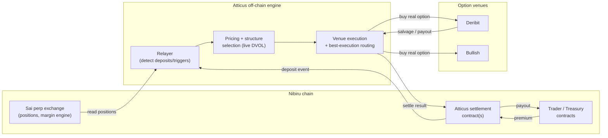
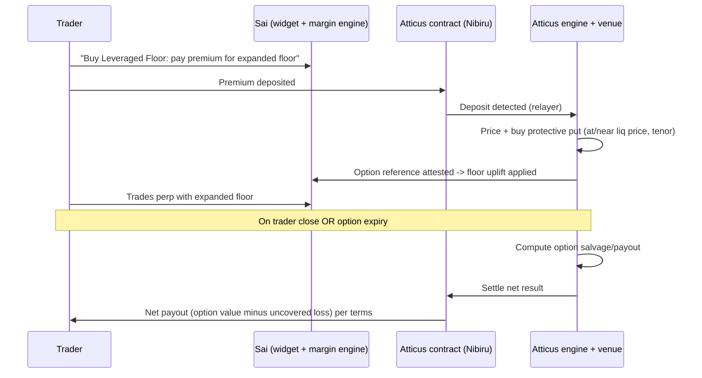
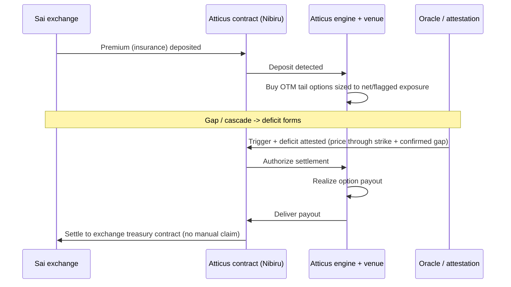
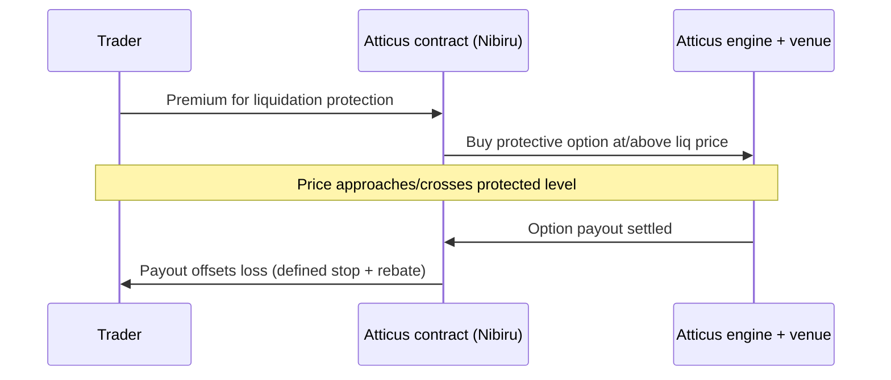

# Atticus × Sai (Nibiru) — Options-Based Protection Integration

Audience: Sai founder + technical team. Goal: enough depth to evaluate feasibility,
integration shape, cost, and risk. Pragmatic, not academic.

---

## 1. Executive Summary

Atticus is a **non-custodial, options-based protection layer** for perp exchanges. It
prices and executes **real listed options** on major venues (Deribit, Bullish) using
live bid/ask and live implied volatility, and settles outcomes to **smart contracts on
the partner chain** — for Sai, contracts on Nibiru. For Sai it delivers three things:
(1) a **paid collateral-floor upgrade** that lets leveraged traders trade larger with a
bounded downside, (2) **bad-debt / tail insurance** that transfers gap-risk off Sai's
balance sheet and shrinks the insurance-fund requirement, and (3) a menu of
**configurable** trader/exchange/MM protections. Because Atticus **passes through real
option liquidity** (rather than minting synthetic cover from an AMM pool) and settles on
Nibiru without holding user funds, Sai gets a capital-efficient risk-transfer rail and a
trader-facing competitive edge with no custody exposure.

**v1 hedgeable universe: BTC and ETH** (deep, liquid listed options). Other markets are
supported **as venue liquidity allows** and are flagged as configurable throughout.

---

## 2. How Atticus Works (Plain English)

A trader or the exchange pays a **premium**. That premium flows into an **Atticus smart
contract on Nibiru** (no end-user custody). Atticus then buys a **matching real option**
at a venue — a put to protect a long, a call to protect a short — sized and struck to the
exposure being protected. When the position closes, the option expires, or a protection
trigger is hit, the option's value is realized and **settled back through the contract**
to the trader or the exchange treasury per the agreed terms. Atticus earns a **transparent
spread/fee**; it is a **pass-through intermediary of real options**, not a synthetic
underwriter — it does not warehouse the tail risk on its own balance sheet.

Two properties make this defensible versus a generic "coverage protocol": **real venue
pricing** (premiums reflect live, tradable markets, not a model or a pool's solvency) and
**regime-aware structure selection** (Atticus chooses the appropriate option structure —
e.g. single-leg put/call, spread, strangle — based on the current volatility regime, so
protection is cost-efficient in calm markets and robust in stressed ones). Settlement is
**non-custodial at the user and exchange layer**; the mechanics of where the option itself
lives are covered honestly in Section 8.

---

## 3. Feature 1 — Leveraged Floor (Pay-to-Trade-Bigger)

A trader pays a small premium and receives an **expanded effective collateral floor**:
because their maximum loss on the position is now **bounded by an option**, Sai's margin
engine can safely recognize additional headroom and let them trade larger (or sit closer
to the line without the same liquidation risk).

**Mechanics (premium → option → floor uplift):**

1. Trader has (or opens) a perp position on Sai — say long BTC.
2. Trader elects "Leveraged Floor" and pays a premium.
3. Atticus buys a **protective put** struck at/near the position's liquidation price for a
   chosen tenor, sized to the position's exposure.
4. That option is **recognized as collateral** by Sai's margin engine, which lifts the
   trader's effective floor (the bounded downside reduces required maintenance margin).
5. The trader trades the perp with the expanded floor for the protection tenor.

**Who pays / who benefits:** the **trader pays** the premium. The trader benefits (more
size / less liquidation risk); the exchange benefits indirectly (healthier positions,
lower liquidation/bad-debt incidence, a premium product to offer).

**Risk profile:** downside is **capped** for the covered tenor at the option's strike
(the floor); **upside is uncapped**. The premium is the trader's only at-risk outlay for
the protection itself. The protection is only as good as the strike placement and the
tenor (see rollover, below).

**Sizing model:** premium scales with **notional × tenor × volatility regime**. The option
notional is matched to the protected exposure; the strike is placed at the liquidation
price (full floor) or with a configurable buffer (cheaper, partial floor). Real-time
quotes come from live venue bid/ask and implied vol.

**Settlement:** when the trader **closes the perp** or the **option expires**, Atticus
computes the option's salvage/settlement value and delivers the net to the trader (or
exchange) contract per terms. If the adverse move occurred, the option payout offsets the
loss up to the floor; if not, the option expires with residual time value (if any) and the
net cost to the trader is the premium minus salvage.

**Tenor / rollover (important):** a perp is perpetual; a listed option is **dated**.
Protection is therefore provided in **tenor windows** (e.g. multi-day) and **rolled** at
expiry. There is a cost and a brief coverage seam at each roll. Auto-roll and roll cadence
are configurable.

**Customization knobs:** max leverage uplift, premium model, eligible markets (BTC/ETH
live), strike placement (at-liq vs buffered), tenor and auto-roll policy, structure
(single-leg vs spread for cost control).

**Dependency on Sai (not an API call — an integration):** Sai's **margin/liquidation
engine must recognize the Atticus option position as collateral** for the floor uplift to
be real. Atticus provides the option + an attestable position reference; Sai's risk engine
consumes it. This is the main Sai-side build for Feature 1.

---

## 4. Feature 2 — Bad Debt Protection

When a position blows through its margin faster than the engine can liquidate — a gap, a
liquidation cascade, or oracle lag — the exchange absorbs the deficit. Atticus transfers
that gap risk to **real options**, settled to the exchange treasury.

**The bad-debt scenario (concrete):**

| Step | Value |
|---|---|
| Trader position | Long BTC, $100,000 notional at 10x |
| Posted margin | $10,000 |
| Gap move | BTC drops 12% before liquidation completes |
| Loss on position | ~$12,000 |
| Margin available | $10,000 |
| **Deficit the exchange eats** | **~$2,000 (bad debt)** |

**How Atticus prevents it:** the exchange holds **out-of-the-money protective options**
(puts against net-long exposure, calls against net-short) at strikes aligned to where
deficits begin. On the gap, the option is in-the-money and its payout — sized to the
covered gap — **settles automatically to the exchange treasury contract** on Nibiru. The
insurance-fund draw is replaced by an option payout.

**Who pays:** typically the **exchange**, as a cost of insurance. Configurable: a
**per-trade fee shared with traders**, or a hybrid where high-leverage trades carry the
premium.

**Coverage scope (configurable):**

| Scope | What it covers | Sizing |
|---|---|---|
| Single-trade | One flagged position | Static, matched to that position |
| Position-level | A specific account/market | Matched per position |
| Portfolio-level | The exchange's **net** book | **Dynamic** — sized to net exposure, rebalanced as the book shifts |

Portfolio-level is the most capital-efficient but requires **continuous net-exposure
sizing** (more build — see Section 13).

**Claim mechanics:** **no manual claims.** A trigger (price through the coverage strike +
a confirmed deficit) is detected via the **oracle/attestation bridge** (Section 10), which
authorizes **automatic settlement** of the option payout to the exchange contract.

**Capital efficiency for the exchange:**

| Model | Capital posture | Tail behavior |
|---|---|---|
| Self-insured fund | Large idle reserve held against worst case | Reserve can still be exhausted by a big enough gap |
| Atticus protection | Pay premium per tenor; little idle capital | Tail transferred to real option payout (bounded by coverage) |

The exchange can run a **smaller insurance fund** and pay a known premium stream instead
of reserving for the worst case.

**Tenor / basis caveats:** same rollover dynamic as Feature 1, and coverage references a
venue index (BTC-USD / ETH-USD) — basis vs Nibiru's perp index is addressed in Section 10.

---

## 5. Feature 3 — Additional Use Cases (configurable)

Each is supported in principle on the same pass-through rails; depth/build varies, flagged
where relevant.

**Liquidation protection for traders.** A trader buys a put/call struck at (or just above)
their liquidation price. If price approaches/crosses it, the option payout offsets the
loss, giving the trader a defined "stop with a rebate" rather than a hard liquidation.
Mechanically a focused case of Feature 1 (protection without the floor-uplift integration);
available for BTC/ETH today, configurable on tenor and strike.

**Funding-rate hedge.** Protects a trader or the exchange from sustained one-sided funding.
Listed options do not directly express funding, so this is **synthetic** (constructed from
a funding reference + a structured payout) and is flagged as **design-required**, not
available off-the-shelf. Best treated as a later workstream once Features 1–2 are live.

**Treasury protection.** The exchange's own treasury (token holdings, fee reserves) hedged
against market downturns using the same pricing/structure engine — a direct application of
the protection rail to Sai's balance sheet. Available for BTC/ETH exposure today;
configurable scope and tenor.

**Market-maker capital efficiency.** MMs hold protective options so their **defined-risk**
positions require less posted capital to maintain depth, freeing capital for tighter
quotes. Requires Sai's margin engine to recognize options as collateral (same dependency
as Feature 1); configurable per MM program.

**Pre-funded trading credits.** Exchange-funded promotions (e.g. "trade with house
credit") where Atticus covers the downside so the exchange's promotional exposure is
bounded. Configurable on credit size, eligible markets, and coverage terms.

---

## 6. Transaction Flow / Architecture

**Overall architecture.**



**Feature 1 — Leveraged Floor.**



**Feature 2 — Bad Debt Protection.**



**Feature 3 (representative — trader liquidation protection).**



---

## 7. Integration Surface

Sai can integrate at the level that fits its stack. All three can coexist.

| Integration model | What it is | Best for |
|---|---|---|
| **Widget** | Embeddable UI ("Buy Floor / Protection") that handles quote + premium deposit | Fastest trader-facing launch |
| **Button / link** | Minimal CTA that opens the Atticus flow | Light touch, low UI work |
| **Backend API** | Sai's backend requests quotes + triggers protection programmatically (e.g. auto-attach bad-debt cover) | Exchange-level / portfolio features |

**What Sai exposes to Atticus:** a **position read interface** (Section 9), a **settlement
contract address** on Nibiru and the settlement asset, the **eligible market list**
(BTC/ETH for v1), and — for Feature 1/MM — a hook for the **margin engine to recognize the
option as collateral**.

**What Atticus provides back:** real-time **quote API** (premium for a given exposure /
tenor / structure), **execution + settlement**, **status webhooks** (protection active /
rolled / settled), and a **read endpoint** for current coverage per account/position.

---

## 8. Smart Contract / Non-Custodial Model

Flow of value:

```
Trader / Exchange  --premium-->  Atticus contract (Nibiru)
Atticus contract   --deposit event-->  Atticus engine
Atticus engine     --executes real option-->  Venue (Deribit / Bullish)
Venue              --salvage / payout-->  Atticus engine
Atticus engine     --settle-->  Atticus contract (Nibiru)
Atticus contract   --payout-->  Trader / Exchange / Treasury contract
```

**Non-custodial — stated precisely (a builder will check this):** Sai's **users and
treasury never hand custody to Atticus**; premiums and payouts move through **on-chain
contracts on Nibiru**, and rules (who is owed what, when) are enforced there. The **option
itself is held in Atticus's account at a centralized venue** (Deribit/Bullish) — that is
where real liquidity lives — so Atticus operates **venue accounts** as the execution
intermediary. In short: **non-custodial at the user/exchange layer; Atticus is a custodial
execution agent at the venue.** The trust model is therefore "Atticus executes and settles
honestly against on-chain rules + venue fills," not "a pool holds everyone's money." Venue
fills are attestable; settlement is contract-enforced.

---

## 9. Read Access Requirement

To know what to protect (and to size/strike correctly), Atticus needs **read access to
positions**. No write access, no custody.

| Field | Why needed |
|---|---|
| Account / position id | Reference the protected position |
| Market (e.g. BTC, ETH) | Determine hedgeable venue instrument |
| Side (long/short) | Put vs call |
| Size / notional | Option sizing |
| Entry price | Context / P&L |
| Mark price + index source | Strike placement, basis assessment |
| Maintenance margin / liquidation price | Strike placement (the floor / trigger level) |
| Position open/close/size-change events | Re-size, roll, or release coverage |

**Polling vs webhook:** webhook (push on position change) is preferred for accuracy;
polling is acceptable. **Latency:** because protection is **pre-positioned** (the option is
bought ahead of the move, not reactively during a gap), **sub-second latency is not
required** — minutes-fresh position data is sufficient for Features 1–2. Exact cadence is
configurable per partner agreement. (Reactive, intra-gap hedging is a different, harder
model and is not what these features rely on.)

---

## 10. Risk + Settlement Mechanics

**Who bears what:**

| Party | Bears | Bounded by |
|---|---|---|
| Trader (Feature 1) | Premium cost | The premium (downside capped at the floor) |
| Exchange (Feature 2) | Premium cost + any deficit **beyond** the coverage size/strike | Chosen coverage scope/strike |
| Atticus | Execution, basis, and venue-fill risk on the pass-through; earns a spread/fee | Not a tail warehouse (pass-through) |

**When settlement fires:** on **perp close** (Feature 1), **option expiry/roll**, or a
**trigger event** (Feature 2 — price through the coverage strike plus a confirmed deficit).

**Oracle / attestation (load-bearing, net-new):** automatic settlement to a Nibiru contract
requires an authoritative signal of (a) the relevant price and (b) for bad debt, the
deficit amount. Options: Nibiru's own price oracle, an exchange-signed attestation of the
deficit, or a combination, with a short **dispute/confirmation window** before payout
finalizes. The exact source and window are **to be determined per partner agreement**.

**Basis risk:** Sai's perp index (Nibiru) and the venue option index (Deribit/Bullish
BTC-USD / ETH-USD) are not guaranteed identical. For BTC/ETH the indices are highly
correlated, but a **residual basis** can leave a small portion of a move uncovered. This is
disclosed, measurable, and configurable (e.g. buffer the strike). Assets without a liquid
venue index are not hedgeable via pass-through.

**Tenor / rollover:** dated options protect perpetual positions in **windows** with
**rolls**; there is a roll cost and a brief seam. Auto-roll policy is configurable.

**Dispute handling:** settlement is rule-based on the contract; disputes reduce to the
attestation source and the confirmation window, not manual claims.

---

## 11. Pricing Model (High-Level)

Premium is **quoted in real time** from live venue bid/ask and live implied volatility:

```
premium  ≈  f( notional , tenor , volatility regime , structure , strike distance )
```

- **Notional** and **tenor** scale premium roughly proportionally and with time.
- **Volatility regime** is read from live market vol; calm regimes are cheaper, stressed
  regimes cost more (the protection is priced off the same markets it's bought in).
- **Structure** is selected for cost-efficiency (e.g. a spread instead of a naked option to
  cap premium where appropriate).
- **Who pays** depends on the feature/model: trader (Feature 1), exchange (Feature 2), or a
  shared per-trade fee — configurable.
- **Revenue share** with Sai (e.g. a markup or fee split on premiums) is supported and set
  **per partner agreement**.

No fixed fees, caps, or latency numbers are committed here; all are set per agreement.

---

## 12. Customization Knobs

| Knob | What Sai tunes |
|---|---|
| Eligible markets | BTC/ETH live; others as venue liquidity allows |
| Max leverage uplift (Feature 1) | How much extra floor an option may unlock |
| Strike placement | At liquidation price (full) vs buffered (cheaper, partial) |
| Coverage scope (Feature 2) | Single-trade / position / portfolio (net) |
| Premium model | Who pays (trader / exchange / shared), markup |
| Payout rules | Where net settles (trader vs treasury), partial vs full |
| Trigger thresholds | Where protection/coverage activates |
| Tenor + auto-roll | Window length and roll cadence |
| Structure policy | Single-leg vs spread vs strangle (cost/robustness trade-off) |
| Revenue share | Fee split with Sai |

---

## 13. What's Not Built Yet (Honesty)

Clear separation of **what exists today** versus **what this integration needs built**.
Effort is qualitative (Small / Medium / Large); no dates are committed.

| Component | Status | Effort |
|---|---|---|
| Real-time option pricing (live bid/ask + implied vol), BTC/ETH | **Exists** | — |
| Regime-aware structure selection | **Exists** | — |
| Venue execution + best-execution routing (Deribit/Bullish) | **Exists** | — |
| Sizing / payout stress-testing (simulation) | **Exists** | — |
| Settlement/close execution + operational guardrails (kill switch) | **Exists** | — |
| **Nibiru settlement contract(s)** (premium-in / payout-out, rules) | **To build** | Medium |
| **Cross-chain premium → venue → payout relayer** | **To build** | Medium |
| **Sai position read integration** (webhook/poll) | **To build** (joint) | Small–Medium |
| **Trigger oracle / attestation bridge** (esp. bad-debt deficit) | **To build** | Medium–Large |
| **Margin-engine recognition of option-as-collateral** (Feature 1, MM) | **To build (Sai-side)** | Medium |
| **Portfolio-level dynamic net-exposure sizing** (Feature 2 advanced) | **To build** | Large |
| **Funding-rate hedge** (synthetic) | **Design required** | Large |

Single-trade / position-level protection for BTC/ETH (Features 1, 2 basic, and most of the
Feature 3 cases) sits closest to existing capability; portfolio-level dynamic coverage,
the oracle bridge, and funding hedges are the larger lifts.

---

## 14. Next Steps for Sai

To move from documentation to a scoped integration, Atticus needs:

1. **Market list confirmation** — confirm v1 is BTC/ETH (and flag any other assets you'd
   want, so we can assess venue hedgeability).
2. **Position read API spec** — fields per Section 9, push (webhook) or poll, and an
   acceptable freshness window.
3. **Nibiru settlement details** — settlement asset (e.g. a stablecoin or NIBI), and the
   contract(s)/treasury address protection should settle into.
4. **Feature prioritization** — which of Feature 1 / Feature 2 / specific Feature 3 cases
   to build first (we recommend starting with one trader-facing feature + bad-debt basic).
5. **Integration model** — widget, button, or backend API (or a combination).
6. **Oracle / attestation approach** — your preference for the price source and the
   bad-debt deficit attestation + acceptable confirmation window.
7. **Commercial model** — who pays per feature, and revenue-share structure.

With (1)–(3) and a chosen first feature, Atticus can return a concrete scope, the specific
build items from Section 13 that apply, and an integration sequence.
