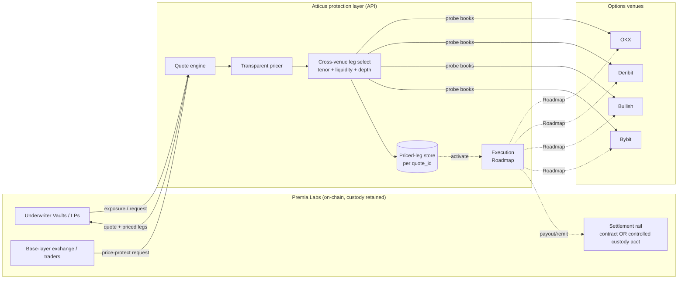
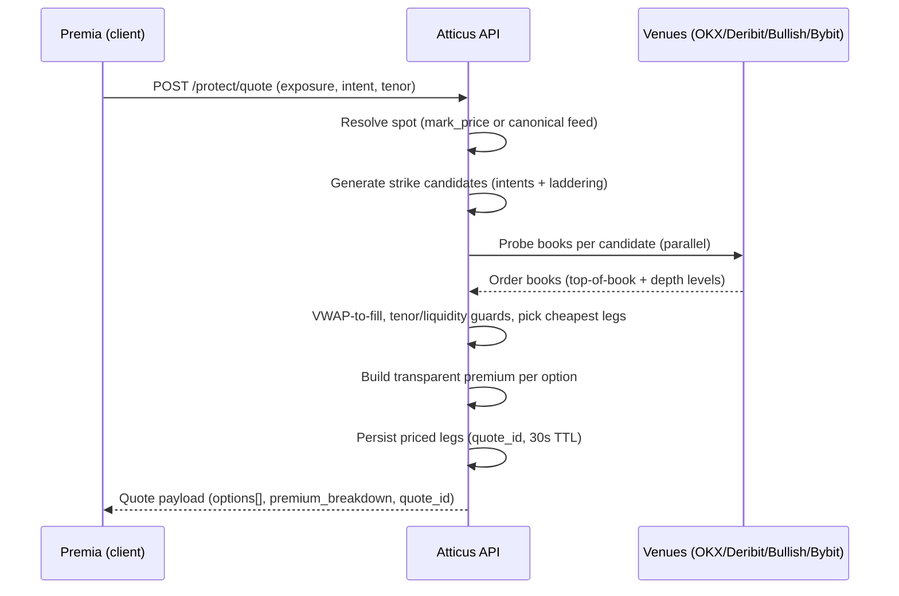
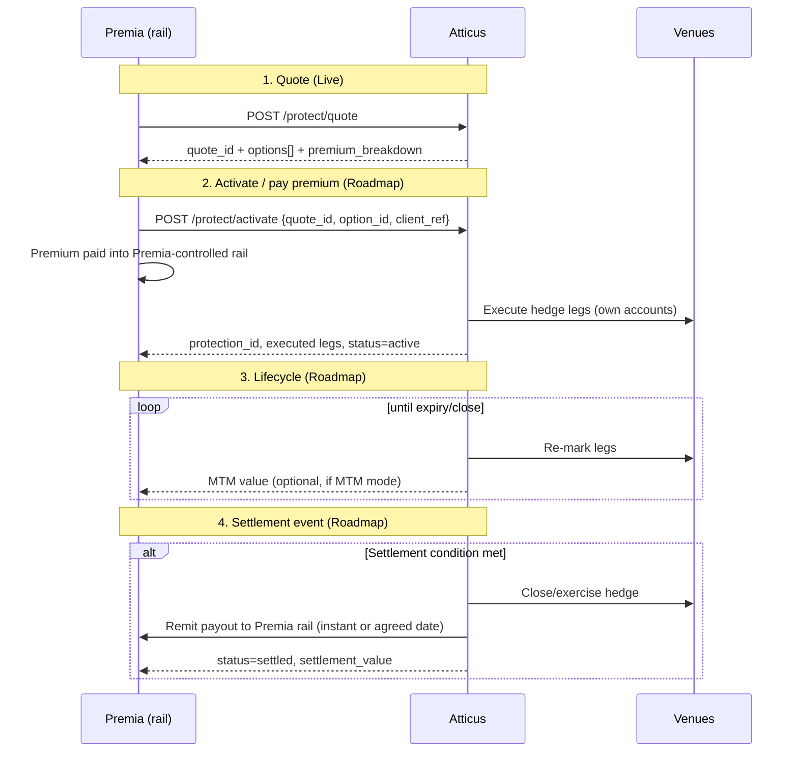
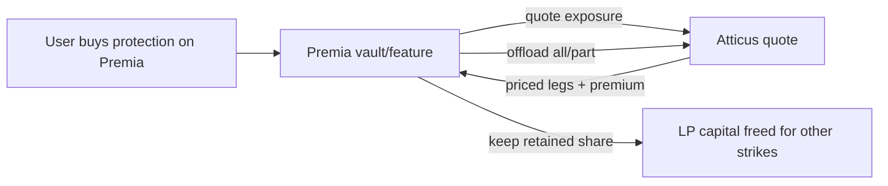
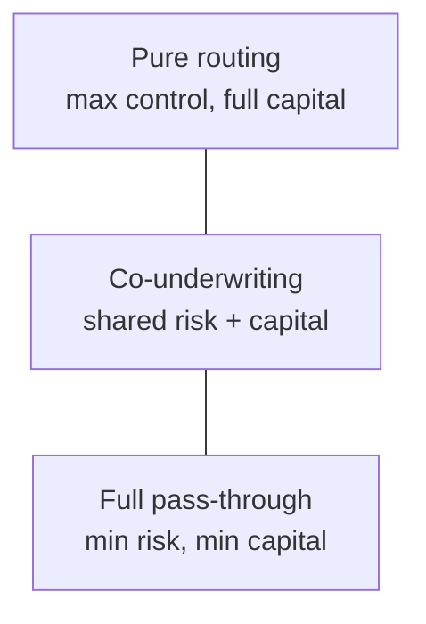
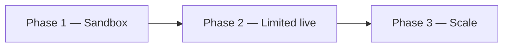

# Atticus × Premia Labs — Integration Reference

**Audience:** Premia Labs engineering + product
**Status:** Quote + multi-venue best-execution **Live**; transactional execution & settlement automation **Roadmap**
**Document type:** Client-facing technical integration reference

Atticus is a **non-custodial, API-first protection layer**. Given a position or exposure, Atticus sources and (on the roadmap) executes the **cheapest qualifying hedge across multiple venues** — depth/size-aware, tenor- and liquidity-normalized — wrapped in a **transparent, customizable premium**. The partner keeps custody at all times.

Throughout this doc:

- **(Live)** — implemented and running today against production venues.
- **(Roadmap)** — designed, not yet shipped; contract/shape may change.
- **(Proposed)** — a model we recommend for Premia; open for co-design.

---

## Table of contents

1. [Executive summary](#1-executive-summary)
2. [Concepts & glossary](#2-concepts--glossary)
3. [Architecture overview](#3-architecture-overview)
4. [Pricing & sourcing](#4-pricing--sourcing)
5. [Non-custodial & security model](#5-non-custodial--security-model)
6. [Settlement & transaction flow](#6-settlement--transaction-flow)
7. [Integration guide](#7-integration-guide)
8. [API reference](#8-api-reference)
9. [Use cases](#9-use-cases)
10. [Liquidity & risk-sharing models](#10-liquidity--risk-sharing-models)
11. [Economics & fees](#11-economics--fees)
12. [Operations](#12-operations)
13. [Onboarding & pilot plan](#13-onboarding--pilot-plan)
14. [Roadmap](#14-roadmap)
15. [FAQ & appendix](#15-faq--appendix)

---

## 1. Executive summary

Premia runs an on-chain options exchange (concentrated-liquidity base layer) and **Underwriter Vaults** (ERC-4626 depots) where LPs underwrite calls/puts across the volatility surface, priced via an SSVI model "at prices close to Deribit's." That LP capital carries directional, gap, and solvency risk that today is warehoused on-chain or hedged manually.

**Atticus gives Premia an off-chain, multi-venue best-execution layer to lay that risk off** — programmatically, transparently, and without giving up custody. The same engine that protects a single perp trader can protect a vault's net book, a treasury's BTC reserves, or backstop protocol solvency.

### Integration options at a glance

| Model | What Premia does | What Atticus does | Custody | Status |
|-------|------------------|-------------------|---------|--------|
| **Pure routing / execution** | Sends quote requests; pays hedge cost | Sources cheapest cross-venue hedge; returns priced legs | Premia | Quote **(Live)**, execute **(Roadmap)** |
| **Partial offload / co-underwriting** | Keeps a share of risk; offloads the tail or a fraction | Underwrites the agreed slice at a transparent load | Premia | **(Proposed)** |
| **Full pass-through** | Routes the whole protection product to Atticus | Underwrites + hedges end-to-end; remits payouts | Premia (settlement rail) | **(Roadmap)** |

You can mix these per product line (e.g. pure routing for vault hedging, full pass-through for a retail price-protect feature).

### Why it fits Premia

- **Non-custodial** — mirrors Premia's own design philosophy; LP/treasury assets never move to Atticus.
- **Best-execution** — never worse than any single book; Atticus compares OKX, Deribit, Bullish, and Bybit on a size-aware basis (**Live**), which directly improves on the "close to Deribit" SSVI benchmark Premia vaults already target.
- **Transparent pricing** — every premium decomposes into hedge + documented loads (no mystery markup), so it's auditable by LPs and risk committees.
- **Composable** — API-first quote → persisted priced legs → execute maps cleanly onto an on-chain settlement contract or a Premia-controlled custody account.

---

## 2. Concepts & glossary

| Term | Meaning in this doc |
|------|---------------------|
| **Protection / hedge** | A long option (or option spread) that caps downside on an exposure. Long exposure → puts; short exposure → calls. |
| **Quote** | A priced, time-boxed set of protection options for a given exposure. Identified by `quote_id`. |
| **Priced legs** | The exact venue/instrument/strike/expiry and ask/bid that back a quote, persisted server-side for activation. |
| **Premium build-up** | The transparent decomposition of the retail premium over Atticus's real hedge cost. |
| **Hedge cost** | The cheapest qualifying ask (size-aware) Atticus pays to acquire the hedge across venues. |
| **Intent** | The protection objective: drawdown floor, liquidation insurance ("stay alive"), or margin-loss cap. |
| **Tenor** | Protection horizon in days. Supports one-shot and (Roadmap) rolling/auto-renew. |
| **Worst case** | Entry-aware maximum loss on the protected exposure, inclusive of premium. |
| **Settlement style** | `european` (default, Live model), `american` (Roadmap), `auto_close` (Roadmap). |
| **MTM** | Mark-to-market: running valuation of an open protection position between trade and expiry. |
| **Co-underwriting** | Premia retains a share of the underwriting risk/economics; Atticus covers the rest. |
| **Counterparty / settlement rail** | The on-chain contract or Premia-controlled custody account through which premiums and payouts flow. |

---

## 3. Architecture overview

Atticus sits **between Premia's protocol surface and the off-chain options venues**. Premia keeps custody and controls the settlement rail; Atticus is the pricing + best-execution brain.



### Data flow (quote — Live)



**Components (Live unless noted):**

- **Quote engine** — entry-aware worst-case math; single vs spread structures; recommendation; sub-liquidation filtering.
- **Transparent pricer** — Decimal money math; documented build-up over hedge cost.
- **Cross-venue leg select** — tenor normalization (≤35% deviation), liquidity guard (≤20% spread), depth/size-aware VWAP.
- **Priced-leg store** — persists exact legs per `quote_id` (TTL); the hook for activation.
- **Execution & settlement** — **(Roadmap)**; see §6.

---

## 4. Pricing & sourcing

### 4.1 Transparent premium build-up (Live)

Atticus **sells protection and hedges it with the real cross-venue option underneath** — it is not a pass-through of the raw ask. The retail premium is a transparent build-up over Atticus's hedge cost, so every cent maps to a real cost:

```
retail = hedge_cost
       + slippage_buffer   (we pay the ask and may not fill there; scales with book spread)
       + tail_load         (gap / pooled-tail risk; larger for spreads that re-expose)
       + capital_charge    (cost of underwriting capital over the tenor)
       + atticus_margin    (sustainable profit line)
```

Component formulas and default loads (all overridable per partner):

| Component | Formula | Default |
|-----------|---------|---------|
| `hedge_cost` | cheapest size-aware ask × size (single); `(long_ask − short_bid) × size` (spread) | — |
| `slippage_buffer` | `hedge × clamp(0.5 × spread_pct, 1%, 10%)` | k=0.5; assumed 6% spread when unknown |
| `tail_load` | `notional × 5bps` (× 2.5 for spreads) | 5 bps |
| `capital_charge` | `notional × 100bps/yr × tenor_days/365` | 100 bps/yr |
| `atticus_margin` | `(hedge + slippage + tail + capital) × 12%` | 12% |
| floor | `max(sum, min_premium)` | $1 |

All-in load typically lands ~**15–25% over the cheapest cross-venue ask**. Because the hedge is sourced at the cheapest qualifying ask across venues, that load is sustainable while still frequently beating any single book's retail price.

### 4.2 Multi-venue, depth-aware sourcing (Live)

| Venue | Access | Region | Depth used | Notes |
|-------|--------|--------|------------|-------|
| **OKX** | Public REST | Global | Yes (multi-level) | Coin-margined BTC options |
| **Deribit** | Public REST | Global | Yes (full book) | Primary deep BTC options book; also used as a fair-value cross-check |
| **Bullish** | Authenticated client | Whitelisted deploy only | Top-of-book | Returns prices in USDC/BTC directly |
| **Bybit** | Public REST (read-only) | Region-gated | Yes (multi-level) | Also a price-competitiveness benchmark; degrades to null off-region |

Selection guards (so cross-venue comparison is honest):

- **Tenor normalization** — venues snap to different expiries; legs whose tenor deviates >35% from target are rejected, and selection compares **price per day**.
- **Liquidity guard** — legs with book spread >20% are rejected.
- **Depth/size-aware VWAP** — Atticus walks the book for the **actual requested size** and uses the size-weighted effective price, flagging if the displayed book can't fully cover the size. A thin top-of-book can't make a venue look cheaper than it's fillable.

Long and short legs of a spread may be sourced from **different venues** — Atticus optimizes each leg independently.

### 4.3 Worked example (Live engine, illustrative book)

**Exposure:** long 0.5 BTC perp, spot \$76,000, entry \$76,000, 10× leverage, 3-day tenor. Liquidation ≈ \$68,400 (−10%).
**Chosen protection:** \$69,000 put ("stay alive" tier), cheapest cross-venue hedge = **\$350.00** for 0.5 BTC, book spread unknown → assumed 6%.

| Component | Calculation | Amount |
|-----------|-------------|--------|
| `hedge_cost` | size-aware ask × 0.5 BTC | $350.00 |
| `slippage_buffer` | 350 × clamp(0.5×0.06, 1%, 10%) = 350 × 3% | $10.50 |
| `tail_load` | 38,000 × 5bps × 1 | $19.00 |
| `capital_charge` | 38,000 × 100bps × 3/365 | $3.12 |
| `atticus_margin` | (350 + 10.50 + 19 + 3.12) × 12% | $45.91 |
| **retail_premium** | sum | **$428.53** |

That's ≈1.13% of the \$38,000 notional / ≈11.3% of the \$3,800 margin to cap a held-to-expiry loss at ≈\$3,929 — fully decomposed and auditable.

---

## 5. Non-custodial & security model

**Atticus never takes custody of Premia or LP assets.** Today's Live surface is **read-only quoting**: Atticus reads market data and an optional exposure description, and returns prices. No funds move through Atticus in the Live system.

### Auth (Live)

| Credential | Header | Scope |
|-----------|--------|-------|
| Partner token (read-only) | `X-Protect-Token` *(client-facing alias for the demo/read-only token)* | Quote + spot endpoints; no internal diagnostics |
| Operator token | `X-Admin-Token` | Adds best-execution diagnostics (venues, competitiveness) — Atticus-internal/ops |

- Tokens are environment-configured server-side and compared in **constant time**; they are never logged or returned.
- A partner token **cannot** reach operator/diagnostic endpoints — the server enforces the boundary.
- Production deployment is per-partner; partner tokens are rotated on request.

### Data handling

- Atticus needs only the **exposure description** (side, size, entry, leverage, tenor, intent) — no wallet keys, no private keys, no on-chain signing authority.
- No PII is required for quoting. Premia can pass an opaque `client_ref` for reconciliation.
- Internal per-leg routing (which venue won) is **not** exposed to client tokens — only the priced result. Venue diagnostics are operator-only.

### What Atticus touches vs not

| Atticus touches | Atticus does **not** touch |
|-----------------|---------------------------|
| Public/authed market data from venues | Premia/LP wallets or vault collateral |
| Exposure parameters you send | On-chain signing or settlement authority (until a Premia-controlled rail is wired, Roadmap) |
| Its own venue execution accounts (Roadmap) | Custody of premiums or payouts (these flow through Premia's chosen rail) |

### Execution & settlement security (Roadmap)

When execution ships, Atticus hedges on its **own** venue accounts and remits settlement to a **Premia-controlled** rail (on-chain contract or controlled custody account). Atticus is never an intermediary custodian of Premia funds. See §6.

---

## 6. Settlement & transaction flow

> **Status:** The quote lifecycle and priced-leg persistence are **(Live)**. Execution, settlement, and remittance are **(Roadmap)** and the specifics below are presented as supported/anticipated models for co-design with Premia.

### 6.1 Custody / settlement rails (Premia-controlled — choose one)

1. **Smart-contract settlement (Proposed)** — premiums and payouts flow through an on-chain contract Premia deploys/controls. Atticus reads contract state for activation triggers and (Roadmap) calls a remit/claim function or signs an attestation that the contract verifies. Best fit for Premia's on-chain, composable, LP-auditable model.
2. **Agreed counterparty/custody account that Premia controls (Proposed)** — premiums are paid into a Premia-controlled exchange/custody account; Atticus remits settlements to that same account. Lower integration lift; suits an early pilot.

In **both** rails, custody stays with Premia. Atticus underwrites/hedges and instructs remittance; it does not hold Premia funds.

### 6.2 Remittance timing

- **Instant (Proposed)** — payout remitted as soon as the settlement condition is met (e.g. on-expiry intrinsic value, or MTM trigger).
- **Agreed remittance date (Proposed)** — payouts netted and remitted on a scheduled date (e.g. weekly), reducing on-chain/transfer overhead for high-frequency rolling programs.

### 6.3 Valuation / settlement modes

- **At expiry (Live model)** — European vanilla: settlement value = intrinsic value at expiry. `payout = max(0, K − S_expiry) × size` (puts) / `max(0, S_expiry − K) × size` (calls), netted of premium already paid.
- **Mark-to-market / MTM (Roadmap)** — running valuation between trade and expiry so Premia can credit/debit LP equity continuously or close early. MTM value is derived from the **live cross-venue mark** of the exact hedging legs (same books Atticus sourced), i.e. `mtm = current_option_mark × size − premium_paid`. This reuses the Live sourcing engine — the same depth-aware marks used for quoting drive the MTM.

### 6.4 Option style

- **European vanilla (Live model, default)** — exercise at expiry only. This is what the Live pricing engine models and what Premia's base layer also uses for its European-style markets, so semantics line up.
- **American-style (Roadmap)** — early exercise / early close. Available as a `settlement_style` once execution + MTM close-out ship; pricing load adjusts for early-exercise optionality.

### 6.5 End-to-end sequence (quote → premium → event → settlement)



---

## 7. Integration guide

### 7.1 Environments

| Environment | Purpose | Status |
|-------------|---------|--------|
| **Sandbox** | Deterministic quotes for wiring/CI; mock venue books | (Live) |
| **Limited live** | Real cross-venue quotes, capped size/notional/tenor, per-partner token | (Live) |
| **Production** | Full size limits; execution & settlement | Quote (Live); execute/settle (Roadmap) |

### 7.2 Auth

Send your partner token on every request:

```
X-Protect-Token: <partner-token>
Content-Type: application/json
```

The token is issued per-partner and scoped to the protect endpoints. Rotate via your Atticus contact.

### 7.3 Quote lifecycle (Live)

- **TTL** — each quote is valid for **30 seconds** (`quote_expires_at` in the payload). After expiry, re-quote; activation against a stale `quote_id` will be rejected (Roadmap).
- **Idempotency / caching** — identical request inputs within a ~20s window return the **same** cached payload (same `quote_id`), so rapid re-quotes (e.g. a debounced UI or a polling vault) don't churn pricing. For explicit idempotency on activation, pass a `client_ref` (Roadmap).
- **Priced-leg persistence** — for the life of the TTL, Atticus stores the exact venue/instrument/strike/expiry and ask/bid behind the quote, so activation executes against the **same** legs that were priced.

### 7.4 Errors (Live)

| HTTP | `error` | Meaning | Action |
|------|---------|---------|--------|
| 400 | `invalid_request` | Missing/invalid params | Fix payload |
| 400 | `limit_exceeded` | Size/notional/tenor over cap | Reduce or request higher limits |
| 401 | `unauthorized` | Missing/invalid token | Check `X-Protect-Token` |
| 503 | `feed_unavailable` | Spot/market feed down | Retry with backoff |

### 7.5 Rate limits & polling vs webhooks

- **Rate limits (Live)** — quote requests are debounce-friendly thanks to the 20s cache. Sustained programmatic polling is supported within per-partner limits (set during onboarding). Use the lightweight `/protect/spot` endpoint for price tickers rather than re-quoting.
- **Polling (Live)** — poll `/protect/quote` for fresh pricing; poll `/protect/spot` (~every few seconds) for marks.
- **Webhooks (Roadmap)** — for activation/settlement events (`activated`, `mtm_update`, `settled`, `remitted`), Atticus will push signed webhooks so Premia needn't poll lifecycle state.

---

## 8. API reference

> Client-facing naming is generalized below (`/v1/protect/*`). The reference implementation today is served under an internal admin-namespaced path; your onboarding packet maps the exact base URL and path for your environment. Shapes are exact.

**Base URL:** `https://<partner-host>/v1` (issued per partner)

### 8.1 `POST /v1/protect/quote` (Live)

Price protection for an exposure across venues. Returns a menu of options with transparent premiums.

**Request body:**

| Field | Type | Required | Semantics |
|-------|------|----------|-----------|
| `side` | `"long"` \| `"short"` | yes | Exposure direction (long → puts, short → calls) |
| `size_usd` | number | preferred | USD notional; `size_btc = size_usd / spot` |
| `size_btc` | number | fallback | Direct BTC size if you track positions in BTC |
| `entry_price` | number | optional | Cost basis; defaults to spot |
| `leverage` | number | yes | `0 < leverage ≤ 100` (use 1 for spot/treasury) |
| `tenor_days` | number | yes | Protection horizon (> 0; capped, default 90) |
| `mark_price` | number | optional | Override spot; else canonical feed |
| `settlement_style` | string | optional | `"european"` (default). `"american"`/`"auto_close"` (Roadmap) |
| `client_ref` | string | optional | Opaque reconciliation tag (echoed; Roadmap for activation idempotency) |

Validation caps (env-overridable per partner): max size 50 BTC, max notional $5M, max tenor 90 days.

**cURL:**

```bash
curl -X POST "https://<partner-host>/v1/protect/quote" \
  -H "Content-Type: application/json" \
  -H "X-Protect-Token: $ATTICUS_PROTECT_TOKEN" \
  -d '{
    "side": "long",
    "size_usd": 38000,
    "leverage": 10,
    "tenor_days": 3,
    "entry_price": 76000
  }'
```

**Response (200) — trader/partner scope (abridged):**

```json
{
  "as_of": "2026-06-09T12:00:00.000Z",
  "quote_id": "pp_lxabc12_k3f9x2",
  "quote_expires_at": "2026-06-09T12:00:30.000Z",
  "position": {
    "side": "long",
    "spot": 76000,
    "entry_price": 76000,
    "size_btc": 0.5,
    "leverage": 10,
    "notional_usdc": 38000,
    "margin_usdc": 3800,
    "liquidation_price": 68400,
    "liq_move_pct": 0.1,
    "unrealized_pnl_usdc": 0
  },
  "settlement_style": "european",
  "liquidation_prevented": false,
  "tenor_days": 3,
  "options": [
    {
      "id": "single-0",
      "label": "Stay alive",
      "structure": "put",
      "strike": 69000,
      "short_strike": null,
      "premium_usdc": 428.53,
      "hedge_cost_usdc": 350.00,
      "premium_breakdown": {
        "hedge_cost_usdc": 350.00,
        "slippage_buffer_usdc": 10.50,
        "tail_load_usdc": 19.00,
        "capital_charge_usdc": 3.12,
        "atticus_margin_usdc": 45.91,
        "retail_premium_usdc": 428.53
      },
      "worst_case_usdc": 3928.53,
      "worst_case_pct_margin": 1.034,
      "capped": true,
      "exposed_beyond": null,
      "protects_before_liq": true,
      "cost_per_day_usdc": 142.84,
      "protect_move_pct": 0.0921,
      "recommended": true,
      "depth": {
        "size_btc": 0.5,
        "long_covered": true,
        "long_slippage_vs_top_pct": 0.012,
        "short_covered": null,
        "size_liquidity_warning": null
      }
    }
  ],
  "liquidation": { "price": 68400, "move_pct": 0.1 },
  "note": "READ-ONLY quote (underwriter model). No execution yet."
}
```

**Field semantics (selected):**

| Field | Meaning |
|-------|---------|
| `options[].structure` | `put` / `call` / `put_spread` / `call_spread` |
| `options[].strike` / `short_strike` | Protection strike; spread short leg (null for singles) |
| `options[].premium_usdc` | Retail premium charged (= `premium_breakdown.retail_premium_usdc`) |
| `options[].worst_case_usdc` | Entry-aware max loss inclusive of premium |
| `options[].capped` | `true` if loss is bounded across the full move; `false` if re-exposed beyond `exposed_beyond` |
| `options[].protects_before_liq` | Strike sits inside the liquidation level (gap-proof) |
| `options[].protect_move_pct` | Adverse move % at which protection engages |
| `options[].recommended` | Engine's suggested option (always a single, never a spread) |
| `options[].depth.size_liquidity_warning` | Non-null if displayed book can't fully cover the requested size |

**Operator-only diagnostics** (present only with the operator token; never exposed to partner tokens): `venues_considered` (venues reachable on any probed strike), `venues_used` (venues that won a leg), `price_competitiveness` (size-aware benchmark vs a comparable listed option). These are Atticus-internal best-execution proofs; available to Premia on request during diligence.

### 8.2 `GET /v1/protect/spot` (Live)

Lightweight current BTC mark for tickers/UI. Not cached.

```bash
curl "https://<partner-host>/v1/protect/spot" \
  -H "X-Protect-Token: $ATTICUS_PROTECT_TOKEN"
```

```json
{ "spot": 76000.00, "as_of": "2026-06-09T12:00:00.000Z" }
```

### 8.3 `POST /v1/protect/activate` (Roadmap)

Execute a previously priced quote against its persisted legs.

```json
{
  "quote_id": "pp_lxabc12_k3f9x2",
  "option_id": "single-0",
  "client_ref": "premia-vault-7f3a"
}
```

Anticipated response: `protection_id`, executed legs, `status: "active"`, `premium_charged_usdc`, `settlement_style`. Must be called before `quote_expires_at`.

### 8.4 `GET /v1/protect/positions/{protection_id}` (Roadmap)

Lifecycle + MTM for an active protection: `status` (`active`/`settled`), `mtm_value_usdc`, `settlement_value_usdc`, `expiry`.

### 8.5 Webhooks (Roadmap)

Signed events: `activated`, `mtm_update`, `settled`, `remitted`. Includes `protection_id`, `client_ref`, values, and a signature for verification.

---

## 9. Use cases

For each: problem → how Atticus solves it → flow → integration steps → settlement/economics → Live vs Roadmap. The first three are requested; the remainder are protection use cases we proactively recommend for a protocol like Premia.

### 9.1 Route Premia's existing price-protect through Atticus (offset risk / free liquidity)

- **Problem:** Premia (or a vault/feature) offers users price protection and warehouses that risk on-chain, tying up LP capital.
- **Solution:** For each protection a user buys, Premia requests an Atticus quote and offloads **all or part** of the risk to the cheapest cross-venue hedge. Premia can pass through the premium, or keep a spread and co-underwrite a fraction.
- **Flow:**



- **Integration steps:** (1) On user purchase, `POST /protect/quote` with the user's exposure. (2) Compare to your on-chain price; set your retail markup. (3) (Roadmap) `POST /protect/activate` for the offloaded fraction; retain the rest. (4) Reconcile via `client_ref`.
- **Settlement/economics:** Full pass-through frees ~100% of the capital that strike would lock; partial offload frees the offloaded fraction. Premium load is transparent (§4.1), so your markup is a clean spread over a known cost.
- **Status:** Quote + sourcing **(Live)**; activation/offload settlement **(Roadmap)**.

### 9.2 Treasury protection (price floor over a long horizon, or rolling short-tenor)

- **Problem:** Premia's treasury (or a token reserve) holds BTC/ETH and wants a downside floor without selling.
- **Solution:** Quote `side: "long", leverage: 1` over the treasury size. Two tenor strategies:
  - **Long single tenor** — one put out to the horizon: simpler, higher upfront premium, no roll risk.
  - **Rolling short tenor (auto-renew, Roadmap)** — repeatedly buy cheap short-dated puts; lower per-period cost but cumulative cost + roll/gap risk.
- **Tenor/cost trade-off:**

| Strategy | Upfront cost | Cumulative cost | Roll risk | Flexibility |
|----------|-------------|-----------------|-----------|-------------|
| Long single tenor | High | Lower if held | None | Low (locked) |
| Rolling short tenor | Low per period | Higher over time | Yes (gaps between rolls) | High (adjust strike/size) |

- **Integration steps:** (1) `POST /protect/quote` with `leverage: 1` and treasury notional. (2) Choose the `drawdown_floor` tier. (3) (Roadmap) activate; for rolling, enable auto-renew with a target floor %.
- **Settlement/economics:** European at-expiry payout funds the floor; MTM (Roadmap) lets the treasury mark the hedge continuously.
- **Status:** Quote **(Live)**; rolling auto-renew + settlement **(Roadmap)**.

### 9.3 Bad-debt / protocol-solvency protection

- **Problem:** A sharp gap can push undercollateralized positions or the vault book into bad debt (solvency tail risk).
- **Solution:** Atticus prices **deep-OTM tail protection** sized to the vault's net delta/gap exposure — a solvency backstop. Feasible **today as standardized BTC/ETH tail puts/calls** via the quote engine; a **bespoke basket** tracking Premia's exact multi-asset book is a custom underwriting engagement.
- **Flow:** Premia computes net book exposure → requests tail-strike quote → offloads the tail (co-underwriting typical here, §10).
- **Integration steps:** (1) Compute net exposure + the gap level you want backstopped. (2) `POST /protect/quote` at a deep strike / longer tenor. (3) Co-underwrite the tail with Atticus.
- **Settlement/economics:** Low premium for deep-OTM tails; payout triggers only on a large gap, directly offsetting bad-debt formation. Bespoke baskets priced case-by-case.
- **Status:** Standardized BTC/ETH tail quotes **(Live)**; multi-asset bespoke basket + settlement **(Roadmap/bespoke)**.

### 9.4 LP / Underwriter-Vault hedging (Proposed)

- **Problem:** Premia's Underwriter Vaults are net-short options across the surface; a directional move hurts LP equity. SSVI pricing targets "close to Deribit," but the vault still carries the residual after fills.
- **Solution:** Atticus hedges the vault's **net option exposure** with the cheapest cross-venue offset (often a different/cheaper book than Deribit alone), reducing LP drawdown. Vault stays the on-chain underwriter; Atticus is the off-chain reinsurance/hedge.
- **Flow:** Vault publishes net Greeks/exposure → Atticus quotes the offsetting structure → vault hedges the share it wants.
- **Integration steps:** (1) Expose vault net delta/short-option exposure. (2) `POST /protect/quote` for the offsetting side. (3) (Roadmap) activate; schedule re-hedge as exposure drifts.
- **Settlement/economics:** Improves vault Sharpe / reduces LP tail; cost is the transparent premium netted against vault spread income. Best as partial offload / co-underwriting (§10).
- **Status:** Quote **(Live)**; programmatic net-exposure hedging + settlement **(Roadmap)**.

### 9.5 Skew / IL offload for concentrated-liquidity LPs (Proposed)

- **Problem:** Concentrated-liquidity range orders carry IL and skew exposure as spot moves through the range.
- **Solution:** Atticus prices option structures that offset the IL/skew profile (e.g. puts/calls bracketing the range), letting LPs cap the convex loss.
- **Integration steps:** (1) Map the range's loss profile to a target strike/tenor. (2) Quote the offsetting structure. (3) Offload partially.
- **Settlement/economics:** Converts open-ended IL into a bounded premium; suits active LPs.
- **Status:** **(Proposed)** — quoting works today for the option legs; the IL-to-strike mapping is a co-design item.

### 9.6 Liquidation-protection embed for Premia perp/leverage users (Proposed)

- **Problem:** Leveraged users get liquidated on wicks; Premia wants a retention/UX feature.
- **Solution:** The Live Perp Protect engine already prices **"stay alive"** liquidation-insurance tiers (strike inside the liquidation level) and capped single vs cheaper spread structures — embeddable directly in a Premia trading UI.
- **Status:** Quote **(Live)**; one-click activation **(Roadmap)**.

---

## 10. Liquidity & risk-sharing models

Premia need not use Atticus exclusively. Three models, mixable per product line:

| Model | Capital provided by | Risk held by | Atticus role | Economics for Premia | Best for |
|-------|---------------------|--------------|--------------|----------------------|----------|
| **Pure routing / execution** | Premia | Premia (then offloaded per trade) | Source + execute cheapest hedge | Pay hedge + load; keep your retail spread | Vault/feature hedging where Premia wants control |
| **Partial offload / co-underwriting** | Both | Shared (agreed split, e.g. tail to Atticus) | Underwrite the agreed slice | Lower capital lockup; share premium economics | Solvency tails, large vault books |
| **Full pass-through** | Atticus | Atticus | Underwrite + hedge + remit end-to-end | Zero risk warehoused; Premia earns a referral/markup | Retail price-protect features |



Trade-off: moving right reduces Premia's capital lockup and warehoused risk, but also reduces the share of premium economics Premia captures. Co-underwriting is usually the sweet spot for vault/solvency risk.

---

## 11. Economics & fees

### 11.1 Load model (Live)

Premium = hedge cost + transparent loads (slippage, tail, capital, margin) — see §4.1. Defaults yield ~15–25% over the cheapest cross-venue ask; every component is itemized in `premium_breakdown`, so Premia (and its LPs) can audit pricing. Loads are configurable per partner.

### 11.2 How partial liquidity changes economics

If Premia **co-underwrites** a fraction `f` of each protection:

- Premia pays Atticus only `f × premium` and retains `(1−f)` of both the risk and the corresponding premium economics on the retained slice.
- Capital freed ≈ `f × (capital that strike would lock on-chain)`.
- Atticus's load applies only to the offloaded slice.

### 11.3 Worked numbers

Using the §4.3 example (premium **\$428.53**, hedge **\$350.00**) on a single protection:

| Model | Premia pays Atticus | Premia retains | Risk warehoused by Premia |
|-------|---------------------|----------------|---------------------------|
| Full pass-through | $428.53 (or routes user premium) | retail markup over $428.53 | $0 |
| 50% co-underwrite | $214.27 | 50% of premium + 50% risk | 50% |
| Pure routing | $428.53 (hedge + load) | retail spread you set | offset per trade |

For a treasury floor on 10 BTC over 30 days at, say, a 0.8%-of-notional hedge, the same build-up applies at scale; capital charge grows linearly with tenor (`100bps/yr × days/365`), which is why rolling short-tenor can be cheaper per period but costlier cumulatively (§9.2).

---

## 12. Operations

| Area | Detail |
|------|--------|
| **Venue coverage** | OKX, Deribit, Bullish, Bybit (Live); leg selection picks cheapest qualifying across all reachable venues |
| **Venue health** | Per-quote reachability is tracked internally (`venues_considered`/`venues_used`); off-region/whitelisted venues degrade to null without blocking the quote |
| **Best-execution proof** | Operator diagnostics include a size-aware competitiveness benchmark vs a comparable listed option; available to Premia during diligence |
| **Failure modes** | Feed down → `503 feed_unavailable` (retry w/ backoff); a venue unreachable → excluded, others still quote; thin book → `size_liquidity_warning` + size-aware pricing so you're never quoted an unfillable top-of-book |
| **Fallbacks** | If only one venue qualifies, Atticus quotes from it (still guarded by liquidity/tenor checks); pricing never silently uses a stale or non-fillable mark |
| **Rate limits** | Per-partner; 20s quote cache smooths bursts; use `/protect/spot` for tickers |
| **Regional constraints** | Bullish requires a whitelisted deploy; Bybit is region-gated. Atticus runs deployments positioned for venue reachability; coverage is per-deployment |
| **SLAs (Proposed)** | Quote latency, uptime, and support targets defined in the pilot agreement |
| **Observability (Roadmap)** | Webhook event stream + position/MTM endpoints for reconciliation |

---

## 13. Onboarding & pilot plan

Phased, low-risk:



| Phase | Scope | What Atticus provides | What we need from Premia |
|-------|-------|-----------------------|--------------------------|
| **1 — Sandbox (Live)** | Wire the quote API; deterministic books | Partner token, sandbox base URL, this doc, schemas | Eng contact; target use case(s) |
| **2 — Limited live (Live quotes)** | Real cross-venue quotes; capped size/notional/tenor; shadow against your on-chain pricing | Live quotes, best-execution diagnostics, support | Exposure feed (vault net/treasury size); chosen risk-sharing model |
| **3 — Scale (Roadmap)** | Activation, settlement rail, webhooks, MTM, higher limits | Execution + settlement, signed events | Settlement rail choice (§6.1); reconciliation keys; limits |

**Deliverables to Premia at each phase:** environment + token, mapped endpoints, schema fixtures, and (Phase 2+) best-execution reports.

---

## 14. Roadmap

| Capability | Status |
|-----------|--------|
| Cross-venue quote engine (entry-aware worst case, single/spread) | **Live** |
| Transparent premium build-up (itemized) | **Live** |
| Multi-venue sourcing (OKX, Deribit, Bullish, Bybit) | **Live** |
| Depth/size-aware VWAP + tenor/liquidity guards | **Live** |
| Protection intents (drawdown floor, liquidation insurance, margin cap) | **Live** |
| Priced-leg persistence per `quote_id` (activation hook) | **Live** |
| Operator best-execution diagnostics | **Live** |
| Spot/mark endpoint | **Live** |
| Transactional execution (`/protect/activate`) | **Roadmap** |
| Settlement rails (on-chain contract / controlled custody) | **Roadmap** |
| Remittance (instant / agreed date) | **Roadmap** |
| MTM valuation + early close | **Roadmap** |
| American-style settlement | **Roadmap** |
| Rolling / auto-renew tenors | **Roadmap** |
| Webhooks (activated / mtm_update / settled / remitted) | **Roadmap** |
| Position/lifecycle endpoint | **Roadmap** |
| Multi-asset / bespoke solvency baskets | **Roadmap / bespoke** |

---

## 15. FAQ & appendix

**Is Atticus custodial?** No. The Live system is read-only quoting; no funds touch Atticus. On the roadmap, premiums/payouts flow through a **Premia-controlled** rail — Atticus underwrites/hedges and instructs remittance, never custodies Premia funds.

**Can you really beat our SSVI/Deribit benchmark?** Atticus sources the cheapest qualifying ask across multiple books on a **size-aware** basis, so the hedge is never worse than any single book — frequently better than Deribit alone. Operator diagnostics quantify this per quote and are shareable in diligence.

**What underlying do you cover?** BTC options today (puts for longs, calls for shorts), single or spread. Other assets / multi-asset baskets are bespoke roadmap.

**European or American?** European vanilla is the default Live model (aligns with Premia's European markets). American-style is roadmap, gated on execution + MTM.

**How fresh is a quote?** 30-second TTL (`quote_expires_at`); identical inputs are cached ~20s to avoid churn. Re-quote after expiry.

**What do you need from us to quote?** Just the exposure: side, size, optional entry, leverage (1 for spot/treasury), tenor, and intent. No keys, no PII.

**How do partial offload economics work?** You pay Atticus's transparent premium only on the offloaded fraction and retain the rest of the risk + economics. See §11.

### Appendix — assumptions & limitations

- Quotes reflect live venue books at request time; fills (Roadmap) are subject to market conditions at activation, mitigated by depth-aware pricing and the slippage buffer.
- Venue reachability varies by deployment region (Bullish whitelisted; Bybit region-gated).
- Worked numbers are illustrative; live premiums depend on real-time books.
- Settlement, remittance, MTM, American style, rolling tenors, and webhooks are **Roadmap** and subject to co-design with Premia.

### Appendix — request/response cheat sheet

| Endpoint | Method | Status | Purpose |
|----------|--------|--------|---------|
| `/v1/protect/quote` | POST | Live | Priced protection menu for an exposure |
| `/v1/protect/spot` | GET | Live | Current BTC mark |
| `/v1/protect/activate` | POST | Roadmap | Execute a quote against persisted legs |
| `/v1/protect/positions/{id}` | GET | Roadmap | Lifecycle + MTM |
| webhooks | push | Roadmap | activated / mtm_update / settled / remitted |

### Contacts

- **Atticus solutions/BD:** _[to be filled in onboarding packet]_
- **Atticus engineering on-call:** _[provided with environment credentials]_
- **Reference implementation:** Perp Protect (`POST /admin/foxify/v2/perp-protect/quote`, `GET .../spot`) — mapped to the generalized `/v1/protect/*` names above for partner integrations.
